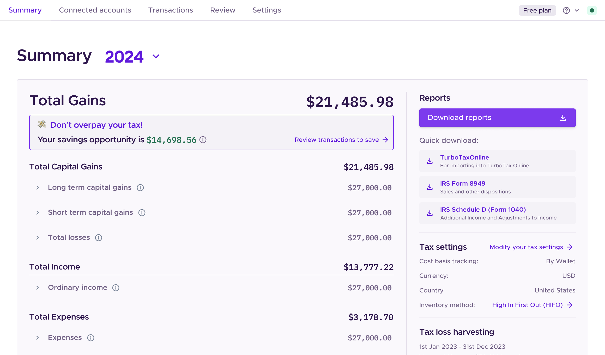
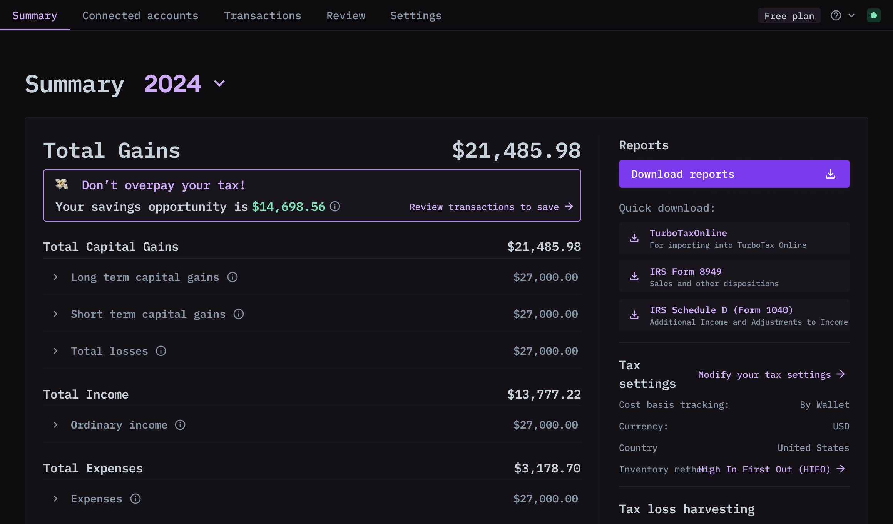

# TaxHub SDK

Simplify crypto tax reporting with TaxHub SDK — a robust, compliant, and user-focused pre-built solution. With real-time compliance updates, multi-jurisdiction support, and advanced customization, it delivers an optimized tax management experience tailored to your users with minimal overhead.

## Introduction

The TaxHub SDK provides developers with an effortless way to integrate a fully branded, production-ready TaxHub into their applications.

Designed to streamline the most complex tax workflows, the SDK offers:

-   Effortless deployment: Deploy in under a day with minimal setup or integration maintenance.
-   Global scalability: Multi-asset and multi-jurisdiction tax compliance and support out-of-the-box.
-   Real-time compliance: Automatically adapt to changing tax regulations in real-time ensuring uninterrupted compliance.
-   Comprehensive security: The SDK is built with best-in-class security practices, including SOC 2 Type II compliance.
-   Advanced customization: Fully configurable to match your brand for a seamless user experience.

## Tailor Your TaxHub

Preview your customized TaxHub solution with our pre-built themes. For advanced customization settings see (See&nbsp;[Customization](/Customization))

<!-- tabs:start -->

#### **Purple**

#### **BlackPink**

<!-- tabs:end -->

## Let's Get Started

All you need to get started is send us your [brand-kit theme](Customization), install the SDK, and render our TaxHub component. Read more in [Getting Started](GettingStarted)
